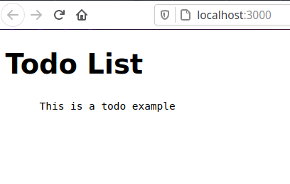

# TODO App

## My notes

First of all, I would like to thank you for this opportunity. I really enjoyed the test. It was one of the more well prepared ones I've done.

I would like to explain my thought process in a few cases through these notes.

1. When creating a TODO app, obviously we would still need to add an Update and a Delete route for the taks. I hope I haven't missed the brief by not adding them.

2. Another improvement would be, to also be able to mark the tasks as done and maybe converting the `Todo` into a checkbox input for better accessiblity.

3. I tried to write my code as I would in production as per your instructions. So, I have aimed for DRY code with a separation of concerns wherever I could. In that spirit, I have created a `tools.js` folder to add any functions that might be reusable, like the `addNewTodo` function. I have also added the `submitAndUpdate` function to help the `AddTodo.js` file stay clean and readable.

4. I am always trying for good accessibility. That's why I have used form and input elements inside the `AddTodo.js` file instead of just divs.

5. While trying to make the app scalable, I have splitted the text input and button input into different components themselves, for future usability.

6. Inside the `InputText.js` I have added a very basic, static error message with some very basic validation in the form, just to show that it was in my considerations.

7. Just added a static description because I couldn't really stand the 89 score in Lighthouse's SEO.

---

## The task

We want to build a TODO web app.

It will allow the users to keep track and organize their tasks.

Your objective is to do the following user story.

```
As a user
I want to be able to add a TODO item
so I can track the things I want to do.
```

The app has two parts, a frontend built in React and a Backend built in NodeJS.

The backend exposes an API to fetch the TODO items, that are be displayed in the page.

We have provided the full backend, you only need to focus on the frontend part.

Please write code as you would for it to be production ready.

While it isn't required to make the front end look slick and well designed we would appreciate any effort that you put into UI design and UX in order to provide a better user experience.

## Starting the application

- Backend: (In the backend folder)

```shell
npm install
npm start # Start the server in the 9091 port
```

- Frontend: (In the root folder)

```shell
npm install
npm start # Starts the app in http://localhost:3000
```

## Backend

You can find it in the `/backend` directory. It's built in Express and stores the TODO items in memory.

- GET /api/todo


- POST /api/todo


## Frontend

You can find it in the `src` folder. It has been build with React and Redux. The list of todos are fetched asynchronously from the backend via Redux-thunk.

You can assume the backend is running under `http://localhost:9091/api/todo`


